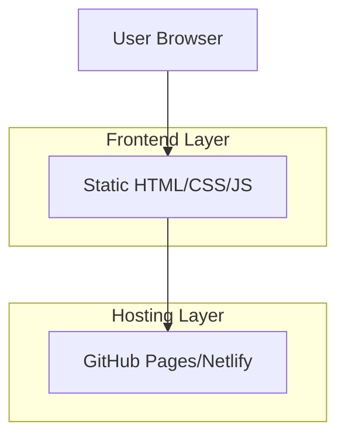
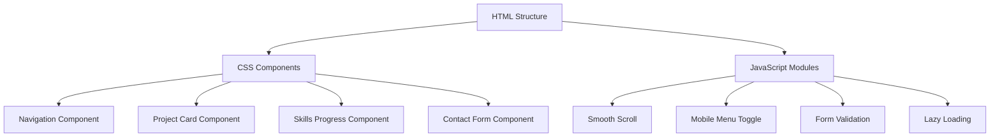

## 1. Architecture Design


## 2. Technology Description
- **Frontend**: HTML5 + CSS3 + Vanilla JavaScript
- **Build Tool**: None (static files)
- **Backend**: None (static website)
- **Hosting**: GitHub Pages/Netlify/Vercel

## 3. Route Definitions
| Route | Purpose |
|-------|---------|
| /index.html | Home page with hero section and navigation |
| /projects.html | Projects portfolio with grid layout |
| /about.html | About page with biography and skills |
| /contact.html | Contact page with form and professional links |

## 4. File Structure
```
portfolio-website/
├── index.html
├── projects.html
├── about.html
├── contact.html
├── css/
│   ├── main.css
│   ├── responsive.css
│   └── components.css
├── js/
│   ├── main.js
│   ├── navigation.js
│   └── contact-form.js
├── assets/
│   ├── images/
│   │   ├── projects/
│   │   └── screenshots/
│   └── icons/
└── documents/
    └── resume.pdf
```

## 5. Component Architecture


## 6. Performance Optimization
- **Image Optimization**: WebP format with fallbacks, responsive images with srcset
- **CSS Optimization**: Minified stylesheets, critical CSS inline
- **JavaScript**: Deferred loading, minimal DOM manipulation
- **Caching**: Browser caching headers, service worker for offline capability
- **Loading Strategy**: Lazy loading for project screenshots, progressive enhancement

## 7. Accessibility Features
- **Semantic HTML**: Proper heading hierarchy, ARIA labels
- **Keyboard Navigation**: Focus indicators, skip links
- **Screen Reader**: Alt text for images, descriptive link text
- **Color Contrast**: WCAG 2.1 AA compliance minimum
- **Responsive Text**: Relative units for scalability

## 8. SEO Optimization
- **Meta Tags**: Title, description, Open Graph tags
- **Structured Data**: JSON-LD for portfolio and contact information
- **Sitemap**: XML sitemap for search engines
- **Performance**: Core Web Vitals optimization
- **Mobile-First**: Responsive design with mobile indexing in mind