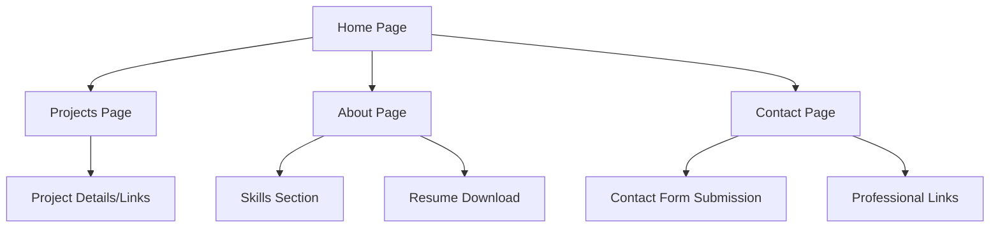

## 1. Product Overview
A clean, modern, minimalist portfolio website for creative professionals to showcase projects, skills, and professional information. The site emphasizes typography, whitespace, and visual hierarchy to create a professional and approachable presence.

## 2. Core Features

### 2.1 User Roles
| Role | Registration Method | Core Permissions |
|------|---------------------|------------------|
| Visitor | No registration required | Browse all content, view projects, submit contact form |

### 2.2 Feature Module
The portfolio website consists of the following main pages:
1. **Home page**: Hero section with headline, brief introduction, navigation to key sections.
2. **Projects page**: Grid layout of project cards with screenshots, titles, descriptions, and links.
3. **About page**: Detailed biography, skills section with proficiency indicators, resume download.
4. **Contact page**: Contact form with professional information and social links.

### 2.3 Page Details
| Page Name | Module Name | Feature description |
|-----------|-------------|---------------------|
| Home page | Hero section | Display compelling headline, brief professional introduction, call-to-action button. |
| Home page | Navigation | Fixed header with smooth scroll to sections, mobile-responsive hamburger menu. |
| Projects page | Project grid | Asymmetrical responsive grid layout, filter by technology/category. |
| Projects page | Project card | Show project screenshot, title, 1-2 paragraph description, technology tags, live demo and source code links. |
| About page | Biography section | Detailed personal and professional background, philosophy statement. |
| About page | Skills section | Visual proficiency indicators (progress bars/icons) for technical and soft skills. |
| About page | Resume download | PDF resume download link with professional formatting. |
| Contact page | Contact form | Simple form with name, email, subject, message fields with validation. |
| Contact page | Professional links | Display email, LinkedIn, GitHub, and other relevant professional profiles. |

## 3. Core Process
### Visitor Flow
1. User lands on homepage with hero section and navigation
2. User can navigate to Projects, About, or Contact sections
3. In Projects section, user can view all projects and click for details/links
4. In About section, user can read biography and view skills
5. In Contact section, user can submit form or use provided contact information

## 4. User Interface Design
### 4.1 Design Style
- **Primary Colors**: Off-white (#FAFAFA) background, deep charcoal (#2D3748) for text
- **Accent Color**: Electric blue (#3182CE) for buttons, links, and highlights
- **Typography**: Inter for headings (bold, 32-48px), Open Sans for body text (16-18px)
- **Button Style**: Rounded corners (8px radius), subtle hover effects, consistent padding
- **Layout Style**: Asymmetrical grid with careful alignment, card-based project display
- **Icon Style**: Minimal line icons, consistent stroke weight, monochrome with accent color highlights

### 4.2 Page Design Overview
| Page Name | Module Name | UI Elements |
|-----------|-------------|-------------|
| Home page | Hero section | Full-width hero with centered content, 48px headline, 18px body text, prominent CTA button with 16px padding |
| Home page | Navigation | Fixed header with 80px height, logo on left, navigation links on right, mobile hamburger at 768px breakpoint |
| Projects page | Project grid | 3-column grid on desktop (min-width: 300px), 2-column on tablet, 1-column on mobile, 24px gap between cards |
| Projects page | Project card | Rounded corners (12px), subtle shadow on hover, 16:9 aspect ratio screenshots, 18px title, 14px description |
| About page | Skills section | Progress bars with 8px height, skill names in 16px font, percentage indicators in accent color |
| Contact page | Contact form | 2-column layout on desktop, stacked on mobile, 48px input height, 16px font size, 4px border radius |

### 4.3 Responsiveness
- **Desktop-first** approach with mobile optimization
- **Breakpoints**: 1200px (desktop), 768px (tablet), 480px (mobile)
- **Touch optimization**: Larger tap targets on mobile (minimum 44px), swipe-friendly project carousel option
- **Performance**: Optimized images with lazy loading, minified CSS/JS for fast loading times